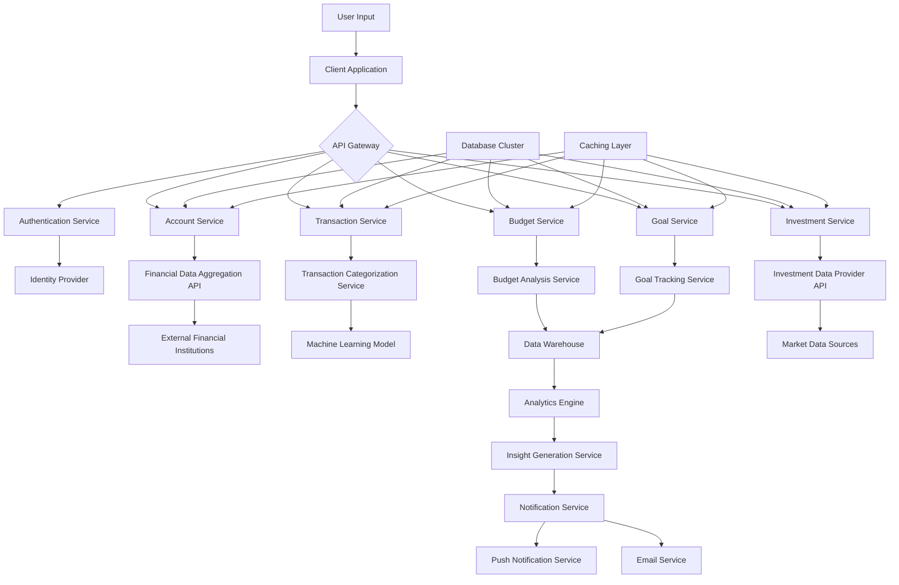

# Data Flow Architecture

This document outlines the data flow architecture of the Mint Replica application, demonstrating how user inputs, external data sources, and internal processes interact to provide a comprehensive personal financial management solution.

## Introduction

The Mint Replica application is designed to process and manage financial data from various sources, providing users with insights and tools to manage their personal finances effectively. This document illustrates how information moves through various components of the system, ensuring data integrity, security, and real-time updates.

## High-Level Data Flow Diagram

## User Input Flow

1. Users interact with the Mint Replica application through web and mobile interfaces.
2. User inputs are validated client-side before being sent to the backend.
3. The API Gateway receives requests and routes them to appropriate microservices.
4. The Authentication Service verifies user credentials and generates JWT tokens for authenticated sessions.
5. Authenticated requests are processed by respective services (Account, Transaction, Budget, Goal, Investment).

## External Data Integration

1. The Account Service interfaces with the Financial Data Aggregation API (e.g., Plaid or Yodlee) to fetch user's financial account data.
2. External financial institutions provide account balances, transactions, and other relevant data through secure APIs.
3. The Investment Service retrieves market data and investment performance metrics from external Investment Data Provider APIs.
4. Credit score information is obtained from credit bureaus through dedicated Credit Score Services.

## Internal Data Processing

1. Transaction Categorization:
   - New transactions are sent to the Transaction Categorization Service.
   - A Machine Learning model categorizes transactions based on description, amount, and historical data.
   - Categorized transactions are stored in the Database Cluster.

2. Budget Analysis:
   - The Budget Service analyzes user spending patterns and compares them against set budgets.
   - Results are stored in the Data Warehouse for further analysis and reporting.

3. Goal Tracking:
   - The Goal Service monitors user progress towards financial goals.
   - It updates goal status based on account balances and user contributions.

4. Investment Portfolio Management:
   - The Investment Service processes investment data and calculates performance metrics.
   - It generates investment insights and recommendations using machine learning models.

## Data Storage and Retrieval

1. Structured data (user accounts, transactions, budgets, goals) is stored in PostgreSQL databases within the Database Cluster.
2. Semi-structured and unstructured data (user preferences, financial insights) is stored in MongoDB collections.
3. Redis is used as a Caching Layer to improve performance for frequently accessed data.
4. The Data Warehouse aggregates data from various sources for complex analytics and reporting.

## Machine Learning Pipeline

1. Training data is periodically extracted from the Data Warehouse.
2. Machine Learning models are trained and evaluated offline.
3. Updated models are deployed to respective services (e.g., Transaction Categorization, Investment Recommendation).
4. The Analytics Engine uses these models to generate personalized insights and predictions.

## Real-time Updates and Notifications

1. The Insight Generation Service processes user data and generates actionable financial insights.
2. The Notification Service determines the relevance and urgency of insights and updates.
3. Real-time notifications are sent to users via Push Notification Service for mobile devices.
4. Email notifications are sent for less time-sensitive updates and summaries.

## Security and Privacy Considerations

1. All data transmissions use TLS 1.3 encryption.
2. Sensitive data (e.g., account credentials, social security numbers) is encrypted at rest using AES-256.
3. Access to user data is controlled through role-based access control (RBAC) and regularly audited.
4. Personal Identifiable Information (PII) is anonymized for data analysis purposes.
5. Users have granular control over data sharing preferences and can request data deletion.

## Scalability and Performance Optimizations

1. Microservices architecture allows independent scaling of system components.
2. The Caching Layer (Redis) reduces database load for frequently accessed data.
3. Database queries are optimized and indexed for performance.
4. Asynchronous processing is used for non-critical operations to improve responsiveness.
5. Content Delivery Networks (CDNs) are utilized to serve static assets and improve global performance.

## Conclusion

The Mint Replica's data flow architecture is designed to securely and efficiently process financial data from various sources, providing users with real-time insights and a comprehensive view of their financial health. By leveraging modern technologies and following best practices in data management and security, the system ensures a robust and scalable solution for personal financial management.

<!-- Human Tasks -->
<!--
TODO: Review and validate the data flow diagram for accuracy and completeness
TODO: Provide specific details on data retention policies and data anonymization techniques
TODO: Confirm compliance with specific financial regulations (e.g., GDPR, CCPA, PSD2) in the data flow
-->