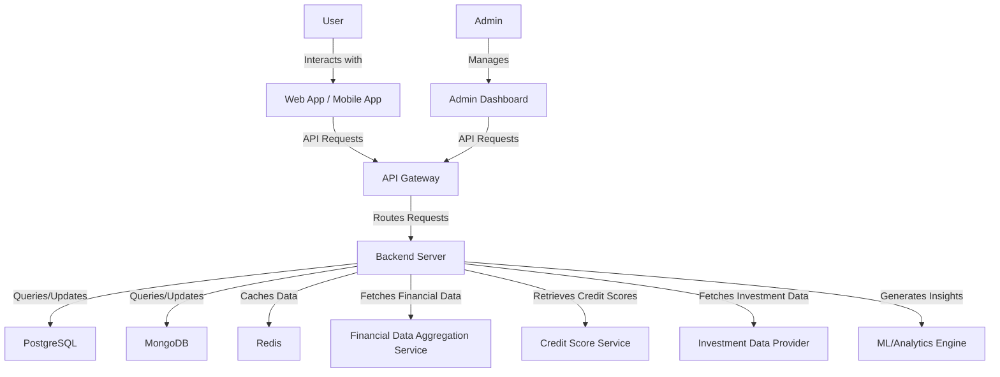

# System Architecture

## Introduction

This document provides a comprehensive overview of the system architecture for the Mint Replica application, detailing the various components, their interactions, and the overall structure of the system.

The Mint Replica is a comprehensive personal financial management application designed to empower users with full control over their financial lives. This system integrates various financial data sources, provides real-time insights, and offers tools for budgeting, goal-setting, and investment tracking.

## System Overview

The Mint Replica system is a modern, scalable, and secure financial management platform built using a microservices architecture. It consists of the following main components:

1. User Interface Layer:
   - Web Application (React)
   - Mobile Application (React Native for iOS and Android)

2. Application Layer:
   - Backend Server (Node.js with Express)
   - API Gateway (AWS API Gateway or Google Cloud Endpoints)

3. Data Layer:
   - Relational Database (PostgreSQL)
   - Document Database (MongoDB)
   - Caching Layer (Redis)

4. External Integrations:
   - Financial Data Aggregation Service (e.g., Plaid or Yodlee)
   - Credit Score Services
   - Investment Data Providers

5. Security and Authentication:
   - Multi-Factor Authentication (MFA)
   - OAuth 2.0 and JWT for API authentication

6. Analytics and Insights:
   - Machine Learning models for transaction categorization and financial insights
   - Real-time data processing for up-to-date financial information

## Architecture Diagram

The following diagram illustrates the high-level architecture of the Mint Replica system:



## Component Descriptions

### User Interface Layer

The user interface layer consists of two main components:

1. Web Application (React):
   - Provides a responsive and interactive user interface for desktop and mobile web browsers
   - Utilizes React for efficient component-based development and state management
   - Implements Material-UI for consistent and modern UI design

2. Mobile Application (React Native for iOS and Android):
   - Offers a native mobile experience for both iOS and Android platforms
   - Shares code between platforms to ensure consistency and reduce development time
   - Utilizes platform-specific APIs for enhanced performance and user experience

### Application Layer

The application layer is responsible for processing requests, implementing business logic, and managing data flow. It consists of:

1. Backend Server (Node.js with Express):
   - Handles API requests from the user interface layer
   - Implements core business logic and data processing
   - Manages integrations with external services and databases
   - Utilizes Express.js for efficient routing and middleware management

2. API Gateway (AWS API Gateway or Google Cloud Endpoints):
   - Provides a single entry point for all API requests
   - Handles request routing, composition, and protocol translation
   - Implements rate limiting, caching, and authentication at the API level

### Data Layer

The data layer is responsible for storing and retrieving application data. It consists of:

1. Relational Database (PostgreSQL):
   - Stores structured data such as user accounts, transactions, and budgets
   - Ensures data integrity through ACID compliance and strong consistency

2. Document Database (MongoDB):
   - Stores semi-structured and unstructured data like user preferences and financial insights
   - Provides flexibility for evolving data structures and efficient querying of complex data

3. Caching Layer (Redis):
   - Improves application performance by caching frequently accessed data
   - Supports session management and real-time data updates

### External Integrations

The Mint Replica system integrates with various external services to provide comprehensive financial data and insights:

1. Financial Data Aggregation Service (e.g., Plaid or Yodlee):
   - Securely connects to users' financial institutions
   - Retrieves and normalizes transaction data, account balances, and other financial information

2. Credit Score Services:
   - Provides up-to-date credit score information for users
   - Offers credit score monitoring and improvement recommendations

3. Investment Data Providers:
   - Fetches real-time investment and market data
   - Provides historical performance data and investment analytics

### Security and Authentication

Security is a top priority for the Mint Replica system. The following measures are implemented:

1. Multi-Factor Authentication (MFA):
   - Requires users to provide multiple forms of identification before accessing their accounts
   - Supports various authentication methods such as SMS, email, and authenticator apps

2. OAuth 2.0 and JWT:
   - Implements OAuth 2.0 for secure authorization of third-party integrations
   - Uses JSON Web Tokens (JWT) for stateless authentication of API requests

3. Encryption:
   - Implements end-to-end encryption for sensitive data transmission
   - Uses AES-256 encryption for data at rest

### Analytics and Insights

The Mint Replica system leverages advanced analytics and machine learning to provide valuable insights to users:

1. Machine Learning Models:
   - Implements transaction categorization using natural language processing and machine learning algorithms
   - Provides personalized financial insights and recommendations based on user data and behavior

2. Real-time Data Processing:
   - Utilizes stream processing technologies for real-time updates of financial data
   - Generates instant notifications and alerts based on user-defined triggers and system-detected anomalies

## Data Flow

The data flow in the Mint Replica system follows these general steps:

1. User input is received through the web or mobile application
2. Requests are sent to the API Gateway, which routes them to the appropriate backend services
3. The backend server processes the requests, interacting with databases and external services as needed
4. Data is retrieved or updated in the PostgreSQL and MongoDB databases
5. Frequently accessed data is cached in Redis for improved performance
6. The backend server sends the processed data back to the client application
7. The client application updates its state and renders the appropriate UI components

For a more detailed data flow diagram, refer to docs/architecture/data_flow.md

## Scalability and Performance

The Mint Replica architecture is designed to support scalability and ensure high performance:

1. Microservices Architecture:
   - Allows independent scaling of different components based on demand
   - Enables easier maintenance and updates of individual services

2. Load Balancing:
   - Implements load balancing at the API Gateway and backend server levels
   - Distributes traffic evenly across multiple instances of services

3. Caching Strategy:
   - Utilizes Redis for caching frequently accessed data
   - Implements intelligent caching policies to reduce database load and improve response times

4. Database Optimization:
   - Uses database indexing and query optimization techniques
   - Implements database sharding for horizontal scalability of PostgreSQL

5. Content Delivery Network (CDN):
   - Utilizes a CDN for serving static assets and improving global performance

## Security Considerations

The Mint Replica system implements various security measures to protect user data and ensure system integrity:

1. Data Encryption:
   - Implements TLS/SSL for all network communications
   - Uses AES-256 encryption for sensitive data at rest

2. Access Controls:
   - Implements role-based access control (RBAC) for user permissions
   - Utilizes the principle of least privilege for system components

3. Security Monitoring:
   - Implements real-time security monitoring and alerting
   - Conducts regular security audits and penetration testing

4. Compliance:
   - Ensures compliance with relevant financial regulations (e.g., GDPR, CCPA, PSD2)
   - Implements comprehensive audit logging for all system activities

For comprehensive security details, refer to docs/architecture/security.md

## Deployment Architecture

The Mint Replica system is deployed using a cloud-native architecture:

1. Cloud Infrastructure:
   - Utilizes AWS or Google Cloud Platform for hosting and managing application infrastructure
   - Implements Infrastructure as Code (IaC) using Terraform for reproducible and version-controlled deployments

2. Containerization:
   - Uses Docker for containerizing application components
   - Implements Kubernetes for container orchestration and management

3. CI/CD Pipeline:
   - Utilizes Jenkins or GitLab CI for automated building, testing, and deployment
   - Implements blue-green deployment strategy for zero-downtime updates

## Monitoring and Logging

To ensure system health and facilitate troubleshooting, the following monitoring and logging solutions are implemented:

1. Centralized Logging:
   - Uses ELK stack (Elasticsearch, Logstash, Kibana) for log aggregation and analysis
   - Implements structured logging for easier parsing and querying

2. Application Performance Monitoring (APM):
   - Utilizes tools like New Relic or Datadog for real-time performance monitoring
   - Implements custom metrics and alerts for critical system components

3. Infrastructure Monitoring:
   - Uses Prometheus and Grafana for monitoring and visualizing infrastructure metrics
   - Implements automated alerts for anomaly detection and system health issues

## Disaster Recovery and Backup

To ensure data integrity and system availability, the following strategies are implemented:

1. Regular Backups:
   - Performs daily incremental backups and weekly full backups of all databases
   - Stores backups in geographically distributed locations

2. Disaster Recovery Plan:
   - Implements a comprehensive disaster recovery plan with defined RPO and RTO
   - Conducts regular disaster recovery drills to ensure plan effectiveness

3. High Availability:
   - Utilizes multi-region deployments for critical components
   - Implements automatic failover mechanisms for database and cache layers

## Future Considerations

As the Mint Replica system evolves, the following enhancements to the architecture may be considered:

1. Serverless Architecture:
   - Explore serverless computing options for certain microservices to improve scalability and reduce operational overhead

2. Event-Driven Architecture:
   - Implement an event-driven architecture using message queues for improved decoupling of services and real-time processing

3. GraphQL API:
   - Consider implementing a GraphQL API to provide more flexible and efficient data querying for client applications

4. Edge Computing:
   - Explore edge computing solutions for improved performance and reduced latency for global users

5. AI-Powered Insights:
   - Enhance the machine learning capabilities to provide more advanced financial insights and predictions

6. Blockchain Integration:
   - Investigate the potential use of blockchain technology for secure and transparent financial transactions

These future considerations will be evaluated based on evolving business requirements, technological advancements, and user needs.

```

Human Tasks:
```markdown
- Review and validate the system architecture diagram
- Confirm cloud infrastructure choice (AWS or Google Cloud) for deployment architecture section
- Provide specific details on chosen monitoring and logging solutions