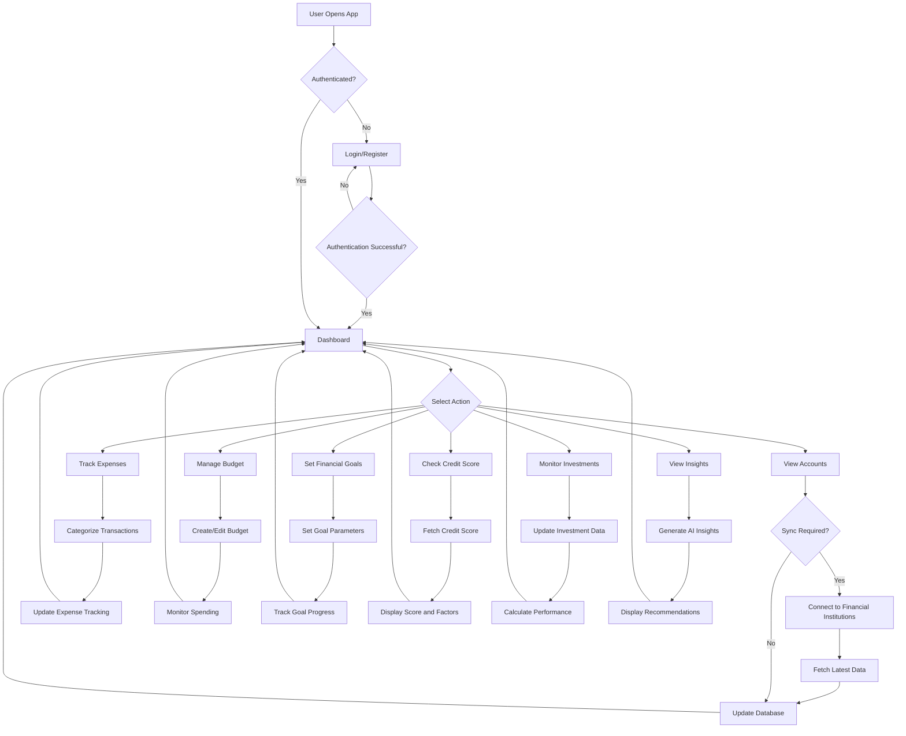
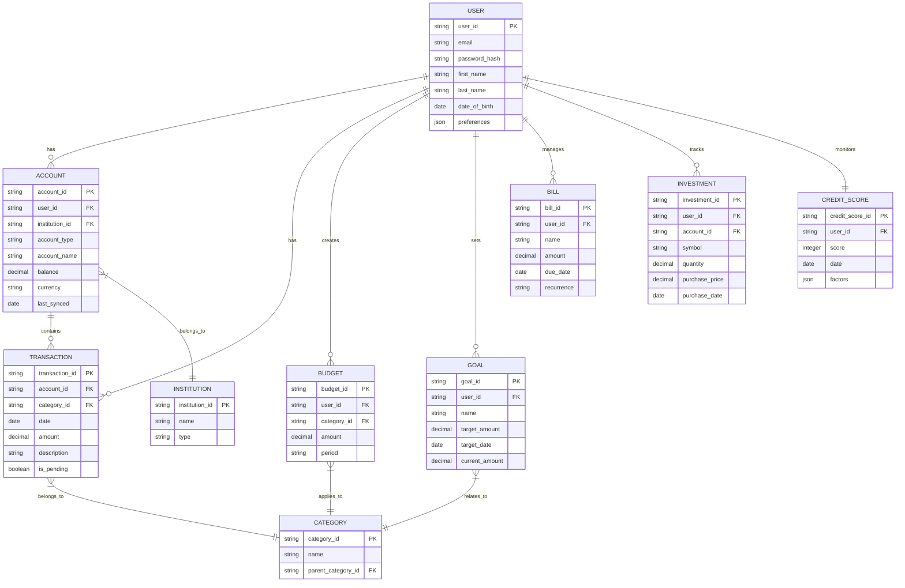
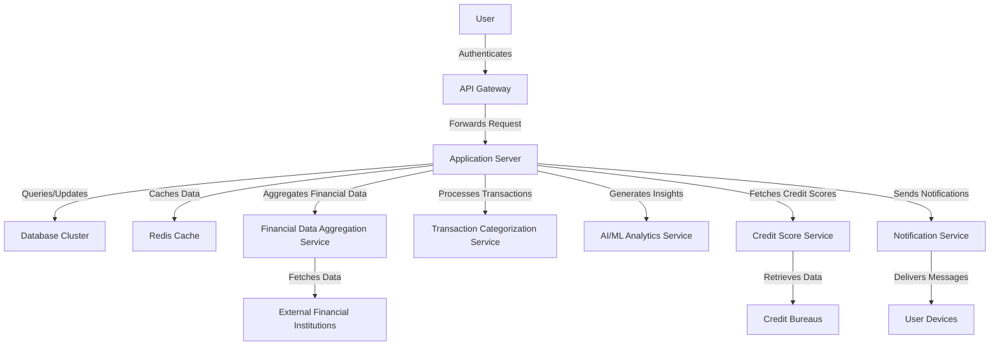

# 1. Introduction

## 1.1 Purpose

The purpose of this Software Requirements Specification (SRS) document is to provide a comprehensive and detailed description of the Mint Replica personal financial management application. This document is intended for use by the development team, project managers, quality assurance testers, and stakeholders involved in the creation and implementation of the application. It serves as a foundation for the entire development process, ensuring that all parties have a clear understanding of the project's requirements, functionalities, and constraints.

## 1.2 Scope

The Mint Replica application is a comprehensive personal financial management tool designed to empower users with full control over their financial lives. The scope of this software product encompasses the following key aspects:

### Goals:
1. Provide a secure, user-friendly platform for managing personal finances
2. Offer real-time aggregation and synchronization of financial data from multiple sources
3. Deliver actionable insights and personalized recommendations to improve users' financial health
4. Ensure the highest level of data security and user privacy

### Benefits:
1. Centralized management of diverse financial accounts and transactions
2. Improved financial awareness and decision-making through comprehensive tracking and analysis
3. Time-saving automation of financial data aggregation and categorization
4. Enhanced financial goal setting and progress monitoring
5. Increased financial security through credit score monitoring and fraud detection

### Core Functionalities:
1. User Authentication and Authorization: Secure multi-factor authentication system with biometric options
2. Account Aggregation: Real-time synchronization with various financial institutions
3. Dashboard: Customizable overview of key financial metrics and recent activities
4. Expense Tracking and Categorization: Automated categorization with machine learning and custom options
5. Budgeting Tools: Flexible budget creation and real-time monitoring
6. Financial Goal Setting: Customizable goals with progress tracking and recommendations
7. Bill Management: Bill tracking, reminders, and payment history
8. Credit Score Monitoring: Regular updates with actionable improvement tips
9. Investment Tracking: Portfolio overview, performance metrics, and benchmarking
10. Personalized Financial Insights: AI-driven recommendations and spending analysis
11. Tax Planning Features: Tax-related expense tracking and reporting

The Mint Replica application will be developed using React Native for mobile platforms and React for the web interface, ensuring a consistent user experience across devices. The backend will be built with Node.js and Express, utilizing PostgreSQL and MongoDB for data storage, and Redis for caching. The system will be deployed on cloud infrastructure (AWS or Google Cloud) to ensure scalability and reliability.

By fulfilling these goals and providing these functionalities, the Mint Replica application aims to become an indispensable tool for individuals seeking to improve their financial well-being through informed decision-making and comprehensive financial management.

## 2. Product Description

### 2.1 Product Perspective

The Mint Replica application is a standalone personal financial management system designed to operate within the broader ecosystem of personal finance and banking services. It interfaces with various external systems and services to provide a comprehensive financial management experience:

1. Financial Institutions: The application integrates with banks, credit card companies, investment firms, and other financial institutions through secure APIs to aggregate user account information and transaction data.

2. Credit Reporting Agencies: It connects with major credit bureaus to provide users with regular credit score updates and monitoring services.

3. Financial Market Data Providers: The system interfaces with real-time market data sources to provide up-to-date investment information and performance metrics.

4. Cloud Infrastructure: The application is deployed on cloud services (AWS or Google Cloud) to ensure scalability, reliability, and global accessibility.

5. Mobile and Web Platforms: The system is designed to work seamlessly across various devices and platforms, including iOS and Android mobile devices, as well as web browsers on desktop computers.

### 2.2 Product Functions

The Mint Replica application offers the following key functions:

1. Account Aggregation: Securely connects and synchronizes data from multiple financial accounts.
2. Transaction Tracking: Automatically categorizes and tracks all financial transactions.
3. Budgeting: Allows users to create, manage, and monitor budgets across various spending categories.
4. Financial Goal Setting: Enables users to set and track progress towards financial goals.
5. Investment Tracking: Provides a comprehensive view of investment portfolios with performance metrics.
6. Credit Score Monitoring: Offers regular credit score updates and improvement recommendations.
7. Bill Management: Tracks bills, sends reminders, and maintains payment history.
8. Personalized Insights: Delivers AI-driven financial advice and spending analysis.
9. Tax Planning: Assists with categorizing tax-related expenses and generating tax summaries.
10. Customizable Dashboard: Presents a user-configurable overview of key financial metrics.
11. Reporting and Analytics: Generates detailed financial reports and visualizations.

### 2.3 User Characteristics

The Mint Replica application is designed to cater to a diverse range of users with varying levels of financial literacy and technological proficiency. The primary user groups include:

1. Young Professionals:
   - Age: 22-35
   - Tech-savvy with moderate financial knowledge
   - Focused on budgeting, debt management, and starting investments

2. Established Adults:
   - Age: 36-55
   - Varying levels of tech and financial literacy
   - Interested in comprehensive financial management, investment tracking, and retirement planning

3. Retirees and Pre-retirees:
   - Age: 56+
   - May have lower tech proficiency but high financial awareness
   - Focused on investment management, retirement income tracking, and estate planning

4. Students:
   - Age: 18-25
   - High tech proficiency with limited financial experience
   - Primarily interested in basic budgeting and expense tracking

5. Small Business Owners:
   - Age: Varied
   - Moderate to high financial literacy with varying tech skills
   - Need both personal and business finance management features

### 2.4 Constraints

The development and operation of the Mint Replica application are subject to the following constraints:

1. Regulatory Compliance:
   - Must adhere to financial data protection regulations such as GDPR, CCPA, and PSD2
   - Compliance with financial industry standards for data security and privacy

2. Technical Limitations:
   - Dependency on third-party APIs for financial data aggregation and credit score information
   - Mobile app performance constraints on older devices or in areas with poor network connectivity

3. Security Requirements:
   - Implementation of robust encryption and security measures to protect sensitive financial data
   - Regular security audits and penetration testing to maintain the highest security standards

4. Data Accuracy:
   - Reliance on the accuracy and timeliness of data provided by financial institutions and other third-party sources

5. User Authentication:
   - Implementation of multi-factor authentication may impact user experience and adoption rates

6. Scalability:
   - Need to handle a potentially large and rapidly growing user base without compromising performance

7. Cross-platform Compatibility:
   - Ensuring consistent functionality and user experience across various devices and operating systems

### 2.5 Assumptions and Dependencies

The following assumptions and dependencies are considered for the Mint Replica application:

Assumptions:
1. Users have access to smartphones or computers with internet connectivity
2. Financial institutions will continue to provide API access for account aggregation
3. Users are willing to share their financial data with the application to receive personalized insights
4. The target market has a need for comprehensive personal financial management tools

Dependencies:
1. Availability and reliability of third-party financial data aggregation services (e.g., Plaid or Yodlee)
2. Continued cooperation from financial institutions for data access and synchronization
3. Stability and performance of the chosen cloud infrastructure provider (AWS or Google Cloud)
4. Timely updates to financial regulations and compliance requirements
5. Availability of accurate and up-to-date financial market data for investment tracking features
6. Ongoing partnerships with credit reporting agencies for credit score monitoring services
7. Reliability of open-source libraries and frameworks used in the development process
8. Availability of skilled developers familiar with React Native, React, Node.js, and related technologies

Here's the PROCESS FLOWCHART section of the SRS using Mermaid JS, maintaining consistency with the previously mentioned technology and framework choices:

## 3. Process Flowchart

The following flowchart illustrates the high-level process flow of the Mint Replica application:



This flowchart outlines the main processes within the Mint Replica application, including:

1. User authentication
2. Dashboard access
3. Account synchronization
4. Expense tracking and categorization
5. Budget management
6. Financial goal setting and tracking
7. Credit score monitoring
8. Investment tracking
9. Personalized insights generation

The flowchart demonstrates how these processes interact and flow back to the main dashboard, providing a comprehensive view of the application's core functionalities.

Here's a breakdown of the Mint Replica product into features, maintaining consistency with the previously mentioned technology and framework choices:

## 4. Functional Requirements

### 4.1 User Authentication and Authorization

#### ID
FR-001

#### Description
Secure user authentication and authorization system to protect user accounts and financial data.

#### Priority
High

#### Table of Functional Requirements

| ID | Requirement | Description |
|----|-------------|-------------|
| FR-001-1 | Multi-factor Authentication | Implement MFA using SMS, email, or authenticator apps |
| FR-001-2 | Biometric Authentication | Support fingerprint and face recognition on compatible devices |
| FR-001-3 | Password Management | Enforce strong password policies and regular password changes |
| FR-001-4 | Session Management | Implement secure session handling and automatic logouts |
| FR-001-5 | Access Control | Define and enforce user roles and permissions |

### 4.2 Account Aggregation

#### ID
FR-002

#### Description
Securely connect and synchronize data from multiple financial accounts.

#### Priority
High

#### Table of Functional Requirements

| ID | Requirement | Description |
|----|-------------|-------------|
| FR-002-1 | Financial Institution Integration | Connect to banks, credit cards, and investment accounts using Plaid or Yodlee |
| FR-002-2 | Real-time Synchronization | Automatically update account balances and transactions |
| FR-002-3 | Manual Account Entry | Allow users to manually add accounts and transactions |
| FR-002-4 | Error Handling | Implement robust error handling for connection issues |
| FR-002-5 | Account Management | Enable users to add, remove, and update linked accounts |

### 4.3 Dashboard

#### ID
FR-003

#### Description
Customizable overview of key financial metrics and recent activities.

#### Priority
High

#### Table of Functional Requirements

| ID | Requirement | Description |
|----|-------------|-------------|
| FR-003-1 | Financial Overview | Display total cash, credit card balances, investments, and net worth |
| FR-003-2 | Recent Transactions | Show a list of recent transactions from all linked accounts |
| FR-003-3 | Budget Status | Display current budget status and spending alerts |
| FR-003-4 | Customization | Allow users to customize dashboard layout and widgets |
| FR-003-5 | Quick Actions | Provide shortcuts to frequently used features |

### 4.4 Expense Tracking and Categorization

#### ID
FR-004

#### Description
Automated categorization of expenses with machine learning and custom options.

#### Priority
High

#### Table of Functional Requirements

| ID | Requirement | Description |
|----|-------------|-------------|
| FR-004-1 | Automatic Categorization | Use machine learning to categorize transactions |
| FR-004-2 | Custom Categories | Allow users to create and manage custom categories |
| FR-004-3 | Transaction Splitting | Enable splitting of transactions across multiple categories |
| FR-004-4 | Bulk Editing | Provide tools for bulk editing and recategorization |
| FR-004-5 | Spending Analysis | Generate interactive charts and graphs for spending trends |

### 4.5 Budgeting Tools

#### ID
FR-005

#### Description
Flexible budget creation and real-time monitoring.

#### Priority
High

#### Table of Functional Requirements

| ID | Requirement | Description |
|----|-------------|-------------|
| FR-005-1 | Budget Creation | Allow users to create custom budgets for various categories |
| FR-005-2 | Budget Templates | Offer predefined budget templates based on spending history |
| FR-005-3 | Real-time Tracking | Update budget status in real-time as transactions occur |
| FR-005-4 | Alerts and Notifications | Send alerts when approaching or exceeding budget limits |
| FR-005-5 | Flexible Time Periods | Support weekly, monthly, and annual budget periods |

### 4.6 Financial Goal Setting

#### ID
FR-006

#### Description
Customizable financial goals with progress tracking and recommendations.

#### Priority
Medium

#### Table of Functional Requirements

| ID | Requirement | Description |
|----|-------------|-------------|
| FR-006-1 | Goal Creation | Enable users to set various financial goals |
| FR-006-2 | Goal Templates | Provide templates for common financial goals |
| FR-006-3 | Progress Tracking | Visually display progress towards each goal |
| FR-006-4 | Recommendations | Offer personalized recommendations to achieve goals faster |
| FR-006-5 | Goal Linking | Allow linking specific accounts or categories to goals |

### 4.7 Bill Management

#### ID
FR-007

#### Description
Bill tracking, reminders, and payment history.

#### Priority
Medium

#### Table of Functional Requirements

| ID | Requirement | Description |
|----|-------------|-------------|
| FR-007-1 | Bill Tracking | Automatically detect and track bills from linked accounts |
| FR-007-2 | Bill Reminders | Send notifications for upcoming bill due dates |
| FR-007-3 | Payment Marking | Allow users to manually mark bills as paid |
| FR-007-4 | Recurring Bills | Support setting up recurring bill reminders |
| FR-007-5 | Payment History | Display bill payment history and patterns |

### 4.8 Credit Score Monitoring

#### ID
FR-008

#### Description
Regular credit score updates with actionable improvement tips.

#### Priority
Medium

#### Table of Functional Requirements

| ID | Requirement | Description |
|----|-------------|-------------|
| FR-008-1 | Credit Score Updates | Provide regular credit score updates through partnerships with credit bureaus |
| FR-008-2 | Score Factors | Display factors affecting the credit score |
| FR-008-3 | Score Simulator | Offer a simulator to show the impact of financial decisions on credit score |
| FR-008-4 | Improvement Tips | Provide actionable advice for improving credit scores |
| FR-008-5 | Score Alerts | Notify users of significant changes in their credit score |

### 4.9 Investment Tracking

#### ID
FR-009

#### Description
Portfolio overview, performance metrics, and benchmarking.

#### Priority
Medium

#### Table of Functional Requirements

| ID | Requirement | Description |
|----|-------------|-------------|
| FR-009-1 | Portfolio Aggregation | Aggregate investment accounts and display overall portfolio |
| FR-009-2 | Performance Metrics | Calculate and display investment performance over time |
| FR-009-3 | Asset Allocation | Show asset allocation and diversification metrics |
| FR-009-4 | Benchmarking | Compare investment performance against relevant market indexes |
| FR-009-5 | Net Worth Calculation | Calculate and display total net worth including all assets and liabilities |

### 4.10 Personalized Financial Insights

#### ID
FR-010

#### Description
AI-driven recommendations and spending analysis.

#### Priority
High

#### Table of Functional Requirements

| ID | Requirement | Description |
|----|-------------|-------------|
| FR-010-1 | AI-driven Insights | Generate personalized financial insights using machine learning |
| FR-010-2 | Spending Analysis | Provide detailed analysis of spending patterns and trends |
| FR-010-3 | Savings Opportunities | Identify potential areas for increasing savings |
| FR-010-4 | Product Recommendations | Suggest relevant financial products based on user's financial situation |
| FR-010-5 | Financial Reports | Generate monthly and annual financial summary reports |

### 4.11 Tax Planning Features

#### ID
FR-011

#### Description
Tax-related expense tracking and reporting.

#### Priority
Low

#### Table of Functional Requirements

| ID | Requirement | Description |
|----|-------------|-------------|
| FR-011-1 | Tax Categories | Allow categorization of transactions for tax purposes |
| FR-011-2 | Deduction Tracking | Track tax-deductible expenses throughout the year |
| FR-011-3 | Tax Reminders | Provide reminders for tax deadlines and estimated payments |
| FR-011-4 | Tax Summaries | Generate year-end tax summaries for easy reporting |
| FR-011-5 | Data Export | Allow export of tax-related data in formats compatible with tax software |

## 5. Non-Functional Requirements

### 5.1 Performance

| ID | Requirement | Description |
|----|-------------|-------------|
| NFR-001 | Response Time | The application should load within 2 seconds on desktop and 3 seconds on mobile devices under normal network conditions. |
| NFR-002 | API Response Time | All API calls should respond within 500ms for 95% of requests under normal load. |
| NFR-003 | Concurrent Users | The system should support at least 100,000 concurrent users without degradation in performance. |
| NFR-004 | Transaction Processing | The system should process financial transactions and updates within 5 seconds of receipt from financial institutions. |
| NFR-005 | Resource Usage | Mobile app should not consume more than 5% of battery life in a 24-hour period when running in the background. |

### 5.2 Safety

| ID | Requirement | Description |
|----|-------------|-------------|
| NFR-006 | Data Backup | Implement daily automated backups of all user data, with the ability to restore from backups within 4 hours. |
| NFR-007 | Disaster Recovery | Maintain a disaster recovery plan that ensures system recovery within 24 hours in case of catastrophic failure. |
| NFR-008 | Data Integrity | Implement checksums and validation to ensure data integrity during transmission and storage. |
| NFR-009 | Failover Mechanism | Implement automatic failover to backup servers in case of primary server failure, with less than 5 minutes of downtime. |
| NFR-010 | Error Handling | Gracefully handle and log all errors without exposing sensitive information to users. |

### 5.3 Security

| ID | Requirement | Description |
|----|-------------|-------------|
| NFR-011 | Data Encryption | Use AES-256 encryption for all data at rest and TLS 1.3 for data in transit. |
| NFR-012 | Authentication | Implement multi-factor authentication (MFA) for all user accounts. |
| NFR-013 | Authorization | Use role-based access control (RBAC) to manage user permissions. |
| NFR-014 | Password Policy | Enforce strong password policy (minimum 12 characters, including uppercase, lowercase, numbers, and symbols). |
| NFR-015 | Session Management | Implement secure session handling with automatic logout after 15 minutes of inactivity. |
| NFR-016 | API Security | Use OAuth 2.0 and JWT for API authentication and authorization. |
| NFR-017 | Vulnerability Scanning | Conduct monthly automated vulnerability scans and address critical issues within 24 hours. |
| NFR-018 | Penetration Testing | Perform annual third-party penetration testing and address all identified vulnerabilities. |

### 5.4 Quality

| ID | Requirement | Description |
|----|-------------|-------------|
| NFR-019 | Availability | Maintain 99.9% uptime, excluding scheduled maintenance windows. |
| NFR-020 | Maintainability | Achieve a code maintainability index of at least 80 as measured by industry-standard tools. |
| NFR-021 | Usability | Achieve a System Usability Scale (SUS) score of at least 80 in user testing. |
| NFR-022 | Scalability | The system should be able to scale horizontally to handle a 200% increase in user base without significant performance degradation. |
| NFR-023 | Reliability | The mean time between failures (MTBF) should be at least 720 hours (30 days). |
| NFR-024 | Recoverability | The mean time to recover (MTTR) from any system failure should not exceed 1 hour. |

### 5.5 Compliance

| ID | Requirement | Description |
|----|-------------|-------------|
| NFR-025 | GDPR Compliance | Ensure full compliance with GDPR requirements, including data protection, user consent, and right to be forgotten. |
| NFR-026 | CCPA Compliance | Comply with California Consumer Privacy Act (CCPA) regulations for users in California. |
| NFR-027 | PSD2 Compliance | Adhere to Payment Services Directive 2 (PSD2) standards for secure open banking APIs. |
| NFR-028 | SOC 2 Compliance | Obtain and maintain SOC 2 Type II certification for security, availability, and confidentiality. |
| NFR-029 | WCAG Compliance | Ensure web and mobile interfaces comply with WCAG 2.1 Level AA standards for accessibility. |
| NFR-030 | PCI DSS Compliance | Maintain PCI DSS compliance for handling credit card information, if applicable. |

These non-functional requirements are designed to ensure that the Mint Replica application meets high standards of performance, safety, security, quality, and compliance. They align with the previously mentioned technology choices, including React Native for mobile, React for web, Node.js with Express for the backend, and cloud deployment on AWS or Google Cloud. The requirements also take into account the use of PostgreSQL, MongoDB, and Redis for data management and caching.

## 6. Data Requirements

### 6.1 Data Models

The Mint Replica application will use a combination of relational and non-relational data models to efficiently store and manage user financial data. The following entity-relationship diagram illustrates the core data structure:



This data model represents the core entities and relationships in the Mint Replica application. It uses a combination of relational tables (stored in PostgreSQL) and document-based collections (stored in MongoDB) to optimize for both structured and unstructured data.

### 6.2 Data Storage

The Mint Replica application will implement a robust data storage strategy to ensure data integrity, availability, and scalability:

1. Primary Storage:
   - PostgreSQL: For structured, relational data (e.g., user accounts, transactions, budgets)
   - MongoDB: For semi-structured and unstructured data (e.g., financial insights, user preferences)

2. Data Retention:
   - Active user data: Retained indefinitely while the account is active
   - Inactive user data: Archived after 12 months of inactivity, deleted after 7 years
   - Transaction history: Retained for 7 years to comply with financial regulations

3. Redundancy:
   - Implement multi-region database clusters for both PostgreSQL and MongoDB
   - Use synchronous replication for critical data and asynchronous replication for non-critical data

4. Backup:
   - Perform daily incremental backups and weekly full backups
   - Store backups in a separate cloud storage service (e.g., Amazon S3 or Google Cloud Storage)
   - Encrypt backups using AES-256 encryption

5. Recovery:
   - Implement point-in-time recovery for PostgreSQL databases
   - Use MongoDB's native backup and restore capabilities for document-based data
   - Regularly test and validate the recovery process to ensure data integrity

6. Scalability:
   - Implement database sharding for both PostgreSQL and MongoDB to handle large data volumes
   - Use read replicas to distribute read traffic and improve performance
   - Implement a caching layer using Redis to reduce database load for frequently accessed data

### 6.3 Data Processing

The Mint Replica application will implement secure and efficient data processing mechanisms:

1. Data Security:
   - Encrypt all sensitive data at rest using AES-256 encryption
   - Use TLS 1.3 for all data in transit
   - Implement field-level encryption for highly sensitive data (e.g., account numbers, social security numbers)
   - Use tokenization for payment card information to comply with PCI DSS requirements
   - Implement strict access controls and audit logging for all data access

2. Data Flow:

The following diagram illustrates the high-level data flow within the Mint Replica application:



3. Data Processing Steps:
   a. Data Ingestion:
      - Securely collect financial data from linked accounts through the Financial Data Aggregation Service
      - Validate and sanitize incoming data to prevent injection attacks and ensure data integrity

   b. Data Transformation:
      - Normalize and standardize data from various sources
      - Categorize transactions using machine learning algorithms in the Transaction Categorization Service
      - Aggregate data for generating financial insights and reports

   c. Data Analysis:
      - Process financial data using AI/ML models in the Analytics Service to generate personalized insights
      - Calculate budget progress, goal tracking, and investment performance metrics

   d. Data Presentation:
      - Prepare and format processed data for display in the user interface
      - Generate visualizations and reports based on user preferences

   e. Data Synchronization:
      - Implement real-time data synchronization between the application server and user devices
      - Use WebSocket connections for push notifications and live updates

4. Batch Processing:
   - Implement nightly batch jobs for heavy computational tasks (e.g., generating monthly reports, updating credit scores)
   - Use distributed processing frameworks (e.g., Apache Spark) for large-scale data analysis tasks

5. Real-time Processing:
   - Implement stream processing for real-time transaction categorization and fraud detection
   - Use message queues (e.g., Apache Kafka) to handle high-volume, real-time data streams

6. Data Validation and Cleansing:
   - Implement input validation on all user-submitted data
   - Develop data cleansing processes to handle inconsistencies and errors in financial data from external sources
   - Implement data reconciliation processes to ensure consistency across different data sources

By implementing these data requirements, the Mint Replica application will ensure secure, efficient, and scalable handling of user financial data, providing a robust foundation for the application's features and functionalities.

## 7. External Interfaces

### 7.1 User Interfaces

The Mint Replica application will provide intuitive and responsive user interfaces across web and mobile platforms. The user interface will be developed using React for web and React Native for mobile applications, ensuring a consistent look and feel across all devices.

Key user interface requirements include:

1. Responsive design that adapts to various screen sizes (desktop, tablet, and mobile)
2. Intuitive navigation with a bottom tab bar for mobile and a side navigation menu for web
3. Customizable dashboard with drag-and-drop widgets
4. Data visualization components for financial charts and graphs
5. Accessibility features compliant with WCAG 2.1 Level AA standards

Placeholder for mockups:

```
[Dashboard Mockup]
[Account Overview Mockup]
[Budget Interface Mockup]
[Transaction List Mockup]
[Goals Tracking Mockup]
```

### 7.2 Software Interfaces

The Mint Replica application will interact with various external software systems and APIs to provide comprehensive financial management features. Key software interfaces include:

1. Financial Data Aggregation API (e.g., Plaid or Yodlee):
   - Purpose: Securely connect and retrieve data from users' financial institutions
   - Data format: JSON
   - Communication protocol: RESTful API over HTTPS
   - Authentication: OAuth 2.0

2. Credit Score API (e.g., TransUnion, Equifax, or Experian):
   - Purpose: Retrieve users' credit score information
   - Data format: JSON
   - Communication protocol: RESTful API over HTTPS
   - Authentication: API key and OAuth 2.0

3. Investment Data API:
   - Purpose: Fetch real-time investment and market data
   - Data format: JSON
   - Communication protocol: RESTful API over HTTPS
   - Authentication: API key

4. Tax Software Integration API:
   - Purpose: Export tax-related financial data to popular tax preparation software
   - Data format: XML or JSON
   - Communication protocol: RESTful API over HTTPS
   - Authentication: OAuth 2.0

5. Push Notification Services:
   - Purpose: Send notifications to users' devices
   - Platforms: Firebase Cloud Messaging (Android), Apple Push Notification Service (iOS)
   - Data format: JSON
   - Communication protocol: HTTP/2

6. Email Service API (e.g., SendGrid or Amazon SES):
   - Purpose: Send transactional emails and notifications
   - Data format: JSON
   - Communication protocol: RESTful API over HTTPS
   - Authentication: API key

### 7.3 Communication Interfaces

The Mint Replica application will utilize various communication interfaces to ensure secure and efficient data transfer between components and external systems:

1. HTTPS:
   - Purpose: Secure communication for all web and API traffic
   - Protocol: TLS 1.3
   - Port: 443

2. WebSocket:
   - Purpose: Real-time updates for dashboard and transaction data
   - Protocol: WSS (WebSocket Secure)
   - Library: Socket.io

3. Database Communication:
   - PostgreSQL: 
     - Purpose: Structured data storage and retrieval
     - Port: 5432
     - Connection pooling: Implemented using pg-pool
   - MongoDB:
     - Purpose: Semi-structured and unstructured data storage and retrieval
     - Port: 27017
     - Connection: Mongoose ODM

4. Redis:
   - Purpose: Caching and session management
   - Port: 6379
   - Library: ioredis

5. Message Queue (e.g., Apache Kafka):
   - Purpose: Handling high-volume, real-time data streams
   - Protocol: Kafka protocol
   - Port: 9092

6. OAuth 2.0:
   - Purpose: Authentication and authorization for third-party integrations
   - Flow: Authorization Code flow with PKCE for mobile apps

7. API Gateway:
   - Purpose: Managing and securing API traffic
   - Implementation: AWS API Gateway or Google Cloud Endpoints
   - Features: Rate limiting, request/response transformation, API key management

These communication interfaces ensure secure, efficient, and scalable data exchange between the Mint Replica application components and external systems, aligning with the previously mentioned technology choices and architectural decisions.

## 8. APPENDICES

### 8.1 GLOSSARY

| Term | Definition |
|------|------------|
| Account Aggregation | The process of collecting and consolidating financial data from multiple accounts and institutions into a single platform. |
| Asset Allocation | The strategic distribution of investments across various asset classes to balance risk and reward according to an individual's goals, risk tolerance, and investment horizon. |
| Biometric Authentication | A security process that relies on unique biological characteristics of an individual, such as fingerprints or facial features, to verify their identity. |
| Credit Utilization | The ratio of a person's current credit card balances to their credit limits, which is an important factor in determining credit scores. |
| Financial Institution | An organization that deals with financial and monetary transactions, such as banks, credit unions, and investment companies. |
| Net Worth | The total value of an individual's assets minus their liabilities, providing a snapshot of overall financial health. |
| Transaction Categorization | The process of assigning specific categories to financial transactions for better organization and analysis of spending patterns. |

### 8.2 ACRONYMS

| Acronym | Expanded Form |
|---------|---------------|
| API | Application Programming Interface |
| AWS | Amazon Web Services |
| CCPA | California Consumer Privacy Act |
| CI/CD | Continuous Integration/Continuous Deployment |
| GDPR | General Data Protection Regulation |
| JWT | JSON Web Token |
| MFA | Multi-Factor Authentication |
| ODM | Object-Document Mapper |
| PCI DSS | Payment Card Industry Data Security Standard |
| PSD2 | Payment Services Directive 2 |
| RBAC | Role-Based Access Control |
| REST | Representational State Transfer |
| SRS | Software Requirements Specification |
| TLS | Transport Layer Security |
| WCAG | Web Content Accessibility Guidelines |

### 8.3 ADDITIONAL REFERENCES

1. React Native Documentation: https://reactnative.dev/docs/getting-started
2. React Documentation: https://reactjs.org/docs/getting-started.html
3. Node.js Documentation: https://nodejs.org/en/docs/
4. Express.js Documentation: https://expressjs.com/
5. PostgreSQL Documentation: https://www.postgresql.org/docs/
6. MongoDB Documentation: https://docs.mongodb.com/
7. Redis Documentation: https://redis.io/documentation
8. AWS Documentation: https://docs.aws.amazon.com/
9. Google Cloud Documentation: https://cloud.google.com/docs
10. OAuth 2.0 Specification: https://oauth.net/2/
11. GDPR Official Text: https://gdpr-info.eu/
12. CCPA Official Text: https://oag.ca.gov/privacy/ccpa
13. PSD2 Official Text: https://eur-lex.europa.eu/legal-content/EN/TXT/?uri=CELEX%3A32015L2366
14. WCAG 2.1 Guidelines: https://www.w3.org/TR/WCAG21/
15. Plaid API Documentation: https://plaid.com/docs/
16. Yodlee API Documentation: https://developer.yodlee.com/docs/api/1.1/overview
17. Socket.io Documentation: https://socket.io/docs/v4
18. Apache Kafka Documentation: https://kafka.apache.org/documentation/
19. Mongoose ODM Documentation: https://mongoosejs.com/docs/
20. JSON Web Token (JWT) Introduction: https://jwt.io/introduction/

These additional references provide comprehensive information on the technologies, frameworks, and regulations mentioned throughout the SRS document. They serve as valuable resources for developers, project managers, and other stakeholders involved in the implementation of the Mint Replica application.