# 1. Introduction

## 1.1 System Overview

The Mint Replica is a comprehensive personal financial management application designed to empower users with full control over their financial lives. This system integrates various financial data sources, provides real-time insights, and offers tools for budgeting, goal-setting, and investment tracking. The application is built using modern web and mobile technologies to ensure a seamless user experience across all devices.

Key components of the system include:

1. User Interface Layer:
   - Web Application (React)
   - Mobile Application (React Native for iOS and Android)

2. Application Layer:
   - Backend Server (Node.js with Express)
   - API Gateway (AWS API Gateway or Google Cloud Endpoints)

3. Data Layer:
   - Relational Database (PostgreSQL)
   - Document Database (MongoDB)
   - Caching Layer (Redis)

4. External Integrations:
   - Financial Data Aggregation Service (e.g., Plaid or Yodlee)
   - Credit Score Services
   - Investment Data Providers

5. Security and Authentication:
   - Multi-Factor Authentication (MFA)
   - OAuth 2.0 and JWT for API authentication

6. Analytics and Insights:
   - Machine Learning models for transaction categorization and financial insights
   - Real-time data processing for up-to-date financial information

The following diagram illustrates the high-level architecture of the Mint Replica system:

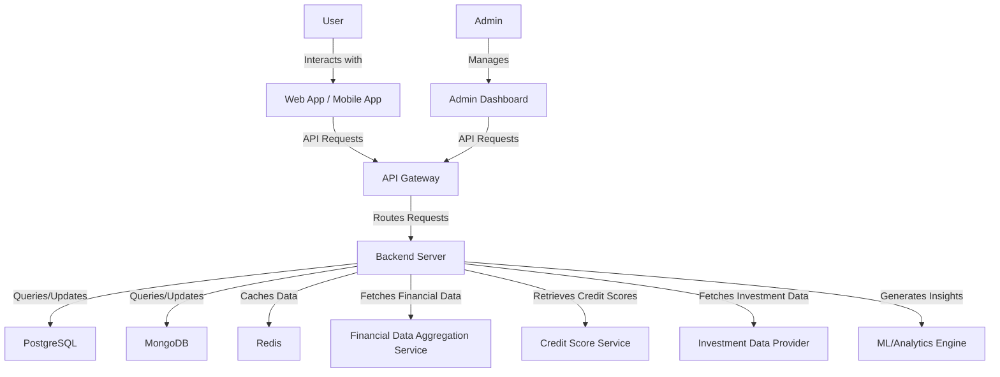

## 1.2 Scope

The Mint Replica application aims to provide a secure, user-friendly, and comprehensive personal financial management solution. The scope of this software product encompasses the following:

### Goals:

1. Deliver a feature-rich financial management platform that rivals or exceeds the capabilities of the original Mint application
2. Ensure the highest level of security and privacy for user financial data
3. Provide real-time, actionable insights to improve users' financial health
4. Offer a seamless and consistent user experience across web and mobile platforms
5. Implement scalable architecture to support a growing user base and expanding feature set

### Benefits:

1. Centralized management of diverse financial accounts and transactions
2. Improved financial awareness and decision-making through comprehensive tracking and analysis
3. Time-saving automation of financial data aggregation and categorization
4. Enhanced financial goal setting and progress monitoring
5. Increased financial security through credit score monitoring and fraud detection
6. Personalized financial insights and recommendations

### Core Functionalities:

| Functionality | Description |
|---------------|-------------|
| Account Aggregation | Securely connect and synchronize data from multiple financial institutions |
| Transaction Tracking | Automatically categorize and track all financial transactions |
| Budgeting | Create, manage, and monitor budgets across various spending categories |
| Financial Goal Setting | Set and track progress towards financial goals |
| Investment Tracking | Provide a comprehensive view of investment portfolios with performance metrics |
| Credit Score Monitoring | Offer regular credit score updates and improvement recommendations |
| Bill Management | Track bills, send reminders, and maintain payment history |
| Personalized Insights | Deliver AI-driven financial advice and spending analysis |
| Tax Planning | Assist with categorizing tax-related expenses and generating tax summaries |
| Customizable Dashboard | Present a user-configurable overview of key financial metrics |
| Reporting and Analytics | Generate detailed financial reports and visualizations |
| Multi-platform Support | Provide consistent functionality across web and mobile platforms |
| Security and Privacy | Implement robust security measures to protect user financial data |

The Mint Replica application will be developed using React for the web interface and React Native for mobile platforms, ensuring a consistent user experience across devices. The backend will be built with Node.js and Express, utilizing PostgreSQL and MongoDB for data storage, and Redis for caching. The system will be deployed on cloud infrastructure (AWS or Google Cloud) to ensure scalability and reliability.

By delivering these functionalities and adhering to the stated goals, the Mint Replica application aims to become an indispensable tool for individuals seeking to improve their financial well-being through informed decision-making and comprehensive financial management.

# 5. SYSTEM ARCHITECTURE

## 5.1 PROGRAMMING LANGUAGES

The Mint Replica application will utilize the following programming languages, chosen for their suitability to the project requirements, ecosystem support, and developer productivity:

| Language | Purpose | Justification |
|----------|---------|---------------|
| JavaScript/TypeScript | Frontend (Web), Backend | - Widely adopted in web development<br>- Large ecosystem of libraries and frameworks<br>- TypeScript adds static typing for improved maintainability |
| Swift | iOS Native Modules | - Official language for iOS development<br>- Performance benefits for complex native functionalities |
| Kotlin | Android Native Modules | - Modern language for Android development<br>- Interoperable with Java libraries<br>- Concise syntax and null safety features |
| SQL | Database Queries | - Standard language for relational database operations<br>- Used with PostgreSQL for complex data queries and management |
| Python | Data Analysis, Machine Learning | - Rich ecosystem for data science and ML libraries<br>- Used for backend data processing and financial analysis tasks |

## 5.2 HIGH-LEVEL ARCHITECTURE DIAGRAM

The following diagram provides an overview of the Mint Replica system's components and their interactions:

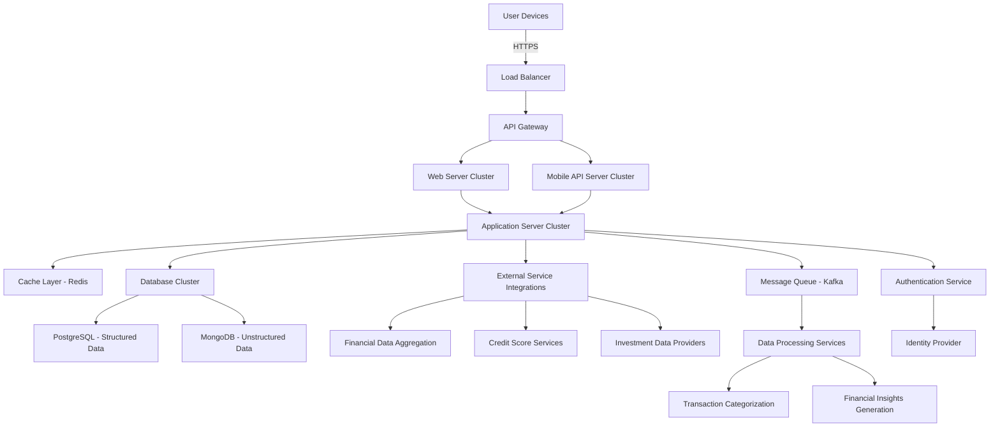

## 5.3 COMPONENT DIAGRAMS

### 5.3.1 Frontend Components

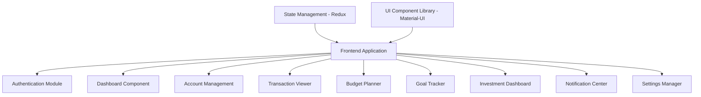

### 5.3.2 Backend Components

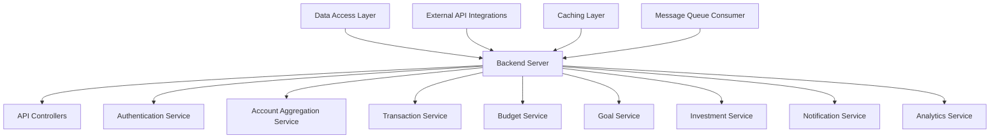

## 5.4 SEQUENCE DIAGRAMS

### 5.4.1 User Authentication Flow

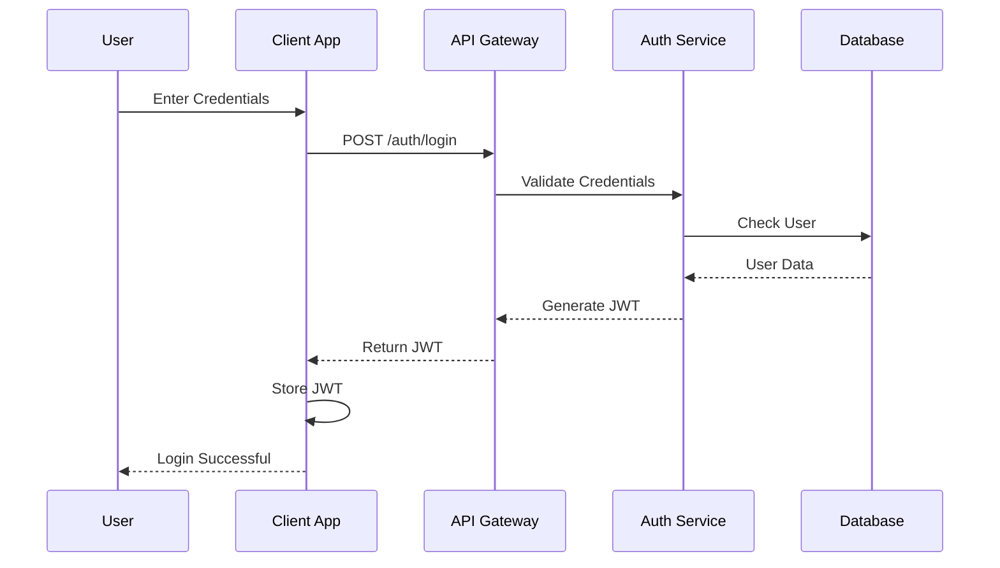

### 5.4.2 Account Synchronization Flow

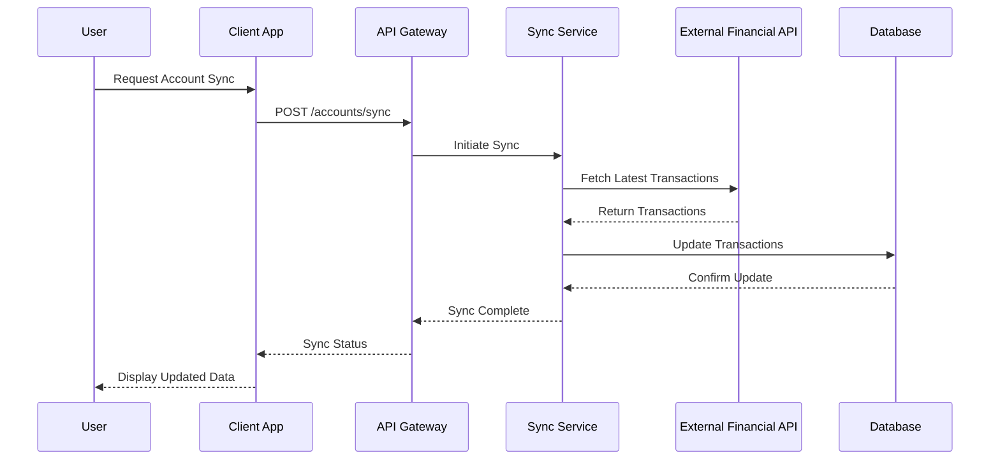

## 5.5 DATA-FLOW DIAGRAM

The following diagram illustrates how information moves through the Mint Replica system:

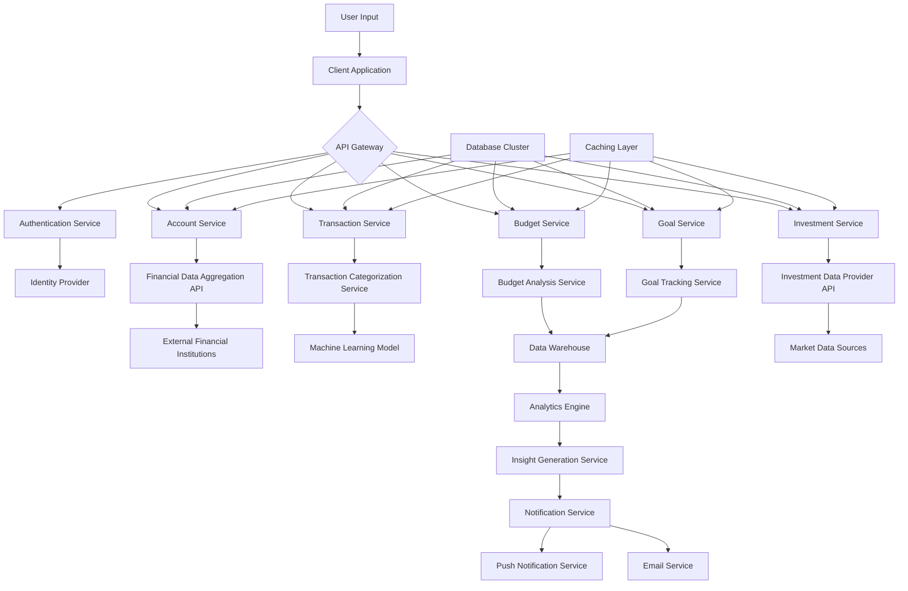

This data flow diagram demonstrates how user inputs and external data sources are processed through various services, stored in databases, analyzed, and ultimately presented back to the user in the form of insights and notifications. The architecture ensures efficient data processing, real-time updates, and scalability to handle large volumes of financial data.

# 5. SYSTEM DESIGN

## 5.1 PROGRAMMING LANGUAGES

The Mint Replica application will utilize the following programming languages, chosen for their suitability to the project requirements, ecosystem support, and developer productivity:

| Language | Purpose | Justification |
|----------|---------|---------------|
| JavaScript/TypeScript | Frontend (Web), Backend | - Widely adopted in web development<br>- Large ecosystem of libraries and frameworks<br>- TypeScript adds static typing for improved maintainability |
| Swift | iOS Native Modules | - Official language for iOS development<br>- Performance benefits for complex native functionalities |
| Kotlin | Android Native Modules | - Modern language for Android development<br>- Interoperable with Java libraries<br>- Concise syntax and null safety features |
| SQL | Database Queries | - Standard language for relational database operations<br>- Used with PostgreSQL for complex data queries and management |
| Python | Data Analysis, Machine Learning | - Rich ecosystem for data science and ML libraries<br>- Used for backend data processing and financial analysis tasks |

## 5.2 DATABASE DESIGN

The Mint Replica application will use a combination of relational (PostgreSQL) and document-based (MongoDB) databases to efficiently store and manage user financial data. Here's an overview of the database design:

### 5.2.1 PostgreSQL Schema

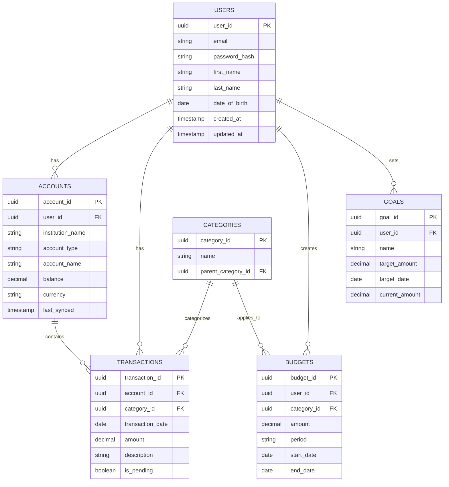

### 5.2.2 MongoDB Collections

1. user_preferences
   - Stores user-specific settings and preferences
   - Flexible schema allows for easy addition of new preferences

2. financial_insights
   - Stores AI-generated financial insights and recommendations
   - Allows for complex, nested data structures

3. investment_portfolios
   - Stores detailed investment data and performance metrics
   - Supports frequent updates and complex queries

4. credit_scores
   - Stores historical credit score data and related factors
   - Allows for easy addition of new credit score providers

## 5.3 API DESIGN

The Mint Replica application will use a RESTful API design for communication between the frontend and backend, as well as for integrating with external services. Here's an overview of the main API endpoints:

### 5.3.1 Authentication API

```
POST /api/auth/register
POST /api/auth/login
POST /api/auth/logout
POST /api/auth/refresh-token
```

### 5.3.2 User API

```
GET /api/users/profile
PUT /api/users/profile
GET /api/users/preferences
PUT /api/users/preferences
```

### 5.3.3 Accounts API

```
GET /api/accounts
POST /api/accounts
GET /api/accounts/{accountId}
PUT /api/accounts/{accountId}
DELETE /api/accounts/{accountId}
POST /api/accounts/{accountId}/sync
```

### 5.3.4 Transactions API

```
GET /api/transactions
POST /api/transactions
GET /api/transactions/{transactionId}
PUT /api/transactions/{transactionId}
DELETE /api/transactions/{transactionId}
```

### 5.3.5 Budgets API

```
GET /api/budgets
POST /api/budgets
GET /api/budgets/{budgetId}
PUT /api/budgets/{budgetId}
DELETE /api/budgets/{budgetId}
```

### 5.3.6 Goals API

```
GET /api/goals
POST /api/goals
GET /api/goals/{goalId}
PUT /api/goals/{goalId}
DELETE /api/goals/{goalId}
```

### 5.3.7 Insights API

```
GET /api/insights
GET /api/insights/{insightId}
```

### 5.3.8 Investments API

```
GET /api/investments
GET /api/investments/{investmentId}
PUT /api/investments/{investmentId}
```

### 5.3.9 Credit Score API

```
GET /api/credit-score
GET /api/credit-score/history
```

## 5.4 USER INTERFACE DESIGN

The Mint Replica application will feature a clean, intuitive user interface designed for ease of use across both web and mobile platforms. Here are some key wireframe mockups:

### 5.4.1 Dashboard

```
+----------------------------------+
|  Logo   Search   Profile  Logout |
+----------------------------------+
| Net Worth: $XX,XXX               |
+----------------------------------+
| [ Accounts ]  [ Budgets ]  [ Goals ]
+----------------------------------+
| Recent Transactions              |
| - Transaction 1     $XX.XX       |
| - Transaction 2     $XX.XX       |
| - Transaction 3     $XX.XX       |
+----------------------------------+
| Spending by Category             |
| [    Pie Chart Visualization   ] |
+----------------------------------+
| Financial Insights               |
| - Insight 1                      |
| - Insight 2                      |
+----------------------------------+
```

### 5.4.2 Account Details

```
+----------------------------------+
|  < Back   Account Name           |
+----------------------------------+
| Current Balance: $X,XXX.XX       |
+----------------------------------+
| [ Transactions ] [ Trends ] [ Settings ]
+----------------------------------+
| Transaction List                 |
| Date  Description      Amount    |
| MM/DD Description 1    $XX.XX    |
| MM/DD Description 2    $XX.XX    |
| MM/DD Description 3    $XX.XX    |
+----------------------------------+
| [    Load More Transactions    ] |
+----------------------------------+
```

### 5.4.3 Budget Overview

```
+----------------------------------+
|  < Back   Budgets                |
+----------------------------------+
| Total Budget: $X,XXX / $X,XXX    |
| [    Progress Bar - XX%        ] |
+----------------------------------+
| Category Budgets                 |
| Food & Dining   $XXX / $XXX      |
| [    Progress Bar - XX%        ] |
|                                  |
| Transportation $XXX / $XXX       |
| [    Progress Bar - XX%        ] |
|                                  |
| Entertainment  $XXX / $XXX       |
| [    Progress Bar - XX%        ] |
+----------------------------------+
| [      Add New Budget          ] |
+----------------------------------+
```

## 5.5 THEME DESIGN

The Mint Replica application will feature a modern, clean design that emphasizes clarity and ease of use. The color scheme and styling will be based on the following theme:

### 5.5.1 Color Palette

- Primary Color: #1E88E5 (Blue)
- Secondary Color: #43A047 (Green)
- Accent Color: #FFA000 (Amber)
- Background Color: #FFFFFF (White)
- Text Color: #333333 (Dark Gray)
- Error Color: #E53935 (Red)

### 5.5.2 Typography

- Primary Font: Roboto
- Headings: Roboto Bold
- Body Text: Roboto Regular
- Font Sizes:
  - H1: 24px
  - H2: 20px
  - H3: 18px
  - Body: 16px
  - Small Text: 14px

### 5.5.3 UI Components

- Buttons:
  - Primary: Filled, rounded corners, Primary Color
  - Secondary: Outlined, rounded corners, Secondary Color
  - Text Buttons: No background, Primary Color text

- Cards:
  - White background
  - Subtle box shadow
  - Rounded corners (8px radius)

- Charts and Graphs:
  - Use the defined color palette for consistency
  - Include legends and tooltips for clarity

- Icons:
  - Material Design icons
  - Color matching the context (e.g., green for positive financial indicators, red for negative)

### 5.5.4 Responsive Design

- The application will use a responsive grid system to ensure proper layout across devices
- Mobile-first approach with progressive enhancement for larger screens
- Breakpoints:
  - Mobile: < 600px
  - Tablet: 600px - 1024px
  - Desktop: > 1024px

This theme design ensures a consistent, professional look across the Mint Replica application, with a focus on readability and user-friendly interactions. The color scheme is chosen to convey trust (blue) and financial growth (green), while providing clear contrast for important information and actions.

# 6. TECHNOLOGY STACK

## 6.1 PROGRAMMING LANGUAGES

The Mint Replica application will utilize the following programming languages:

| Language | Purpose | Justification |
|----------|---------|---------------|
| JavaScript/TypeScript | Frontend (Web and Mobile), Backend | - Widely adopted in web and mobile development<br>- Large ecosystem of libraries and frameworks<br>- TypeScript adds static typing for improved maintainability and reduced errors |
| Python | Data Analysis, Machine Learning | - Rich ecosystem for data science and ML libraries<br>- Efficient for data processing and financial analysis tasks |
| SQL | Database Queries | - Standard language for relational database operations<br>- Used with PostgreSQL for complex data queries and management |
| Swift | iOS Native Modules | - Official language for iOS development<br>- Necessary for implementing platform-specific features |
| Kotlin | Android Native Modules | - Modern language for Android development<br>- Interoperable with Java libraries<br>- Required for platform-specific Android features |

## 6.2 FRAMEWORKS AND LIBRARIES

The following frameworks and libraries will be utilized in the Mint Replica application:

### Frontend
- React: JavaScript library for building user interfaces (Web)
- React Native: Framework for building cross-platform mobile applications
- Redux: State management library for JavaScript applications
- Material-UI: React component library implementing Google's Material Design
- Chart.js: JavaScript charting library for data visualization
- Formik: Form management library for React and React Native

### Backend
- Node.js: JavaScript runtime for server-side development
- Express.js: Web application framework for Node.js
- Passport.js: Authentication middleware for Node.js
- Sequelize: ORM for Node.js, supporting PostgreSQL
- Mongoose: ODM for MongoDB with Node.js
- TensorFlow.js: Machine learning library for JavaScript

### Testing and Quality Assurance
- Jest: JavaScript testing framework
- React Testing Library: Testing utilities for React components
- Cypress: End-to-end testing framework
- ESLint: Static code analysis tool for identifying problematic patterns in JavaScript code

### DevOps and Deployment
- Docker: Containerization platform
- Kubernetes: Container orchestration system
- Jenkins: Continuous Integration/Continuous Deployment (CI/CD) tool

## 6.3 DATABASES

The Mint Replica application will employ the following database systems:

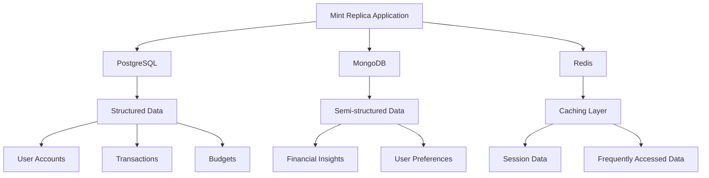

1. PostgreSQL:
   - Purpose: Primary database for structured data
   - Use cases: User accounts, transactions, budgets, goals
   - Justification: ACID compliance, robust querying capabilities, and strong data integrity

2. MongoDB:
   - Purpose: Database for semi-structured and unstructured data
   - Use cases: Financial insights, user preferences, investment portfolios
   - Justification: Flexibility for evolving data structures, efficient for document-based data

3. Redis:
   - Purpose: In-memory data structure store
   - Use cases: Caching, session management, real-time data updates
   - Justification: High performance, low latency, support for various data structures

## 6.4 THIRD-PARTY SERVICES

The Mint Replica application will integrate the following external services and APIs:

1. Financial Data Aggregation:
   - Service: Plaid or Yodlee
   - Purpose: Securely connect and retrieve data from users' financial institutions
   - Justification: Provides standardized access to a wide range of financial institutions

2. Credit Score Monitoring:
   - Services: TransUnion, Equifax, or Experian
   - Purpose: Retrieve users' credit score information
   - Justification: Access to official credit score data and factors

3. Investment Data:
   - Service: Alpha Vantage or IEX Cloud
   - Purpose: Fetch real-time investment and market data
   - Justification: Comprehensive and up-to-date financial market information

4. Cloud Infrastructure:
   - Service: Amazon Web Services (AWS) or Google Cloud Platform (GCP)
   - Purpose: Hosting, scaling, and managing application infrastructure
   - Justification: Robust, scalable, and feature-rich cloud platforms

5. Email Service:
   - Service: SendGrid or Amazon SES
   - Purpose: Send transactional emails and notifications
   - Justification: Reliable email delivery with high deliverability rates

6. Push Notifications:
   - Services: Firebase Cloud Messaging (Android), Apple Push Notification Service (iOS)
   - Purpose: Send notifications to users' mobile devices
   - Justification: Official push notification services for respective platforms

7. Analytics:
   - Service: Google Analytics or Mixpanel
   - Purpose: Track user behavior and application performance
   - Justification: Comprehensive analytics capabilities for data-driven decision making

8. Error Tracking:
   - Service: Sentry or Rollbar
   - Purpose: Monitor and track application errors in real-time
   - Justification: Rapid identification and resolution of issues in production

This technology stack has been carefully selected to provide a robust, scalable, and maintainable foundation for the Mint Replica application. It leverages industry-standard technologies and services to ensure efficient development, high performance, and a seamless user experience across web and mobile platforms.

# 7. SECURITY CONSIDERATIONS

## 7.1 AUTHENTICATION AND AUTHORIZATION

The Mint Replica application will implement a robust authentication and authorization system to ensure secure access to user accounts and data.

### 7.1.1 Authentication

| Method | Description |
|--------|-------------|
| Multi-Factor Authentication (MFA) | Users will be required to provide at least two forms of identification before accessing their accounts. |
| Password Requirements | Strong password policies will be enforced, requiring a minimum of 12 characters, including uppercase, lowercase, numbers, and symbols. |
| Biometric Authentication | Fingerprint and face recognition will be supported on compatible mobile devices. |
| OAuth 2.0 | Used for third-party integrations and API access. |
| JWT (JSON Web Tokens) | Employed for maintaining user sessions and API authentication. |

### 7.1.2 Authorization

The application will implement Role-Based Access Control (RBAC) to manage user permissions:

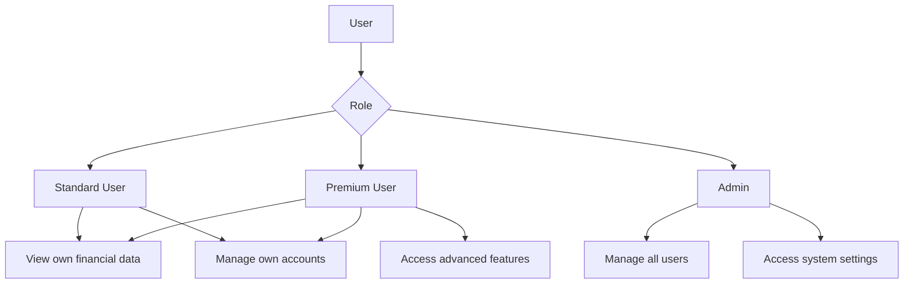

## 7.2 DATA SECURITY

Protecting sensitive financial information is paramount for the Mint Replica application.

### 7.2.1 Encryption

| Data State | Encryption Method |
|------------|-------------------|
| Data at Rest | AES-256 encryption for all stored data |
| Data in Transit | TLS 1.3 for all network communications |
| Sensitive Fields | Field-level encryption for highly sensitive data (e.g., account numbers, social security numbers) |

### 7.2.2 Data Anonymization and Tokenization

- Implement data anonymization techniques for aggregated data analysis
- Use tokenization for payment card information to comply with PCI DSS requirements

### 7.2.3 Data Access Controls

- Implement principle of least privilege for all system components
- Use database-level access controls to restrict data access based on user roles
- Implement audit logging for all data access and modifications

## 7.3 SECURITY PROTOCOLS

The following security protocols will be implemented to maintain system security:

### 7.3.1 Network Security

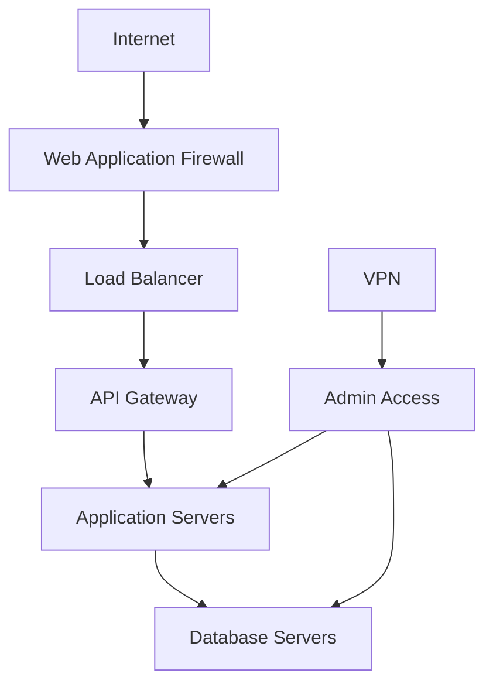

- Implement Web Application Firewall (WAF) to protect against common web exploits
- Use Virtual Private Cloud (VPC) to isolate application components
- Implement network segmentation to separate web, application, and database tiers

### 7.3.2 Secure Development Practices

- Follow OWASP Top 10 guidelines for secure application development
- Implement secure coding practices and conduct regular code reviews
- Use static and dynamic application security testing (SAST and DAST) tools

### 7.3.3 Vulnerability Management

| Activity | Frequency |
|----------|-----------|
| Automated Vulnerability Scans | Weekly |
| Third-Party Penetration Testing | Annually |
| Dependency Vulnerability Checks | Daily (as part of CI/CD pipeline) |

### 7.3.4 Incident Response and Disaster Recovery

- Develop and maintain an incident response plan
- Implement real-time security monitoring and alerting
- Conduct regular disaster recovery drills
- Maintain off-site backups with encryption

### 7.3.5 Compliance and Auditing

- Ensure compliance with relevant financial regulations (e.g., GDPR, CCPA, PSD2)
- Implement comprehensive audit logging for all system activities
- Conduct regular security audits and assessments
- Maintain up-to-date documentation of all security measures and protocols

By implementing these security considerations, the Mint Replica application will provide a secure environment for users' financial data, aligning with industry best practices and regulatory requirements. These measures are designed to work in harmony with the previously mentioned technology choices, including React Native for mobile, React for web, Node.js with Express for the backend, and cloud deployment on AWS or Google Cloud.